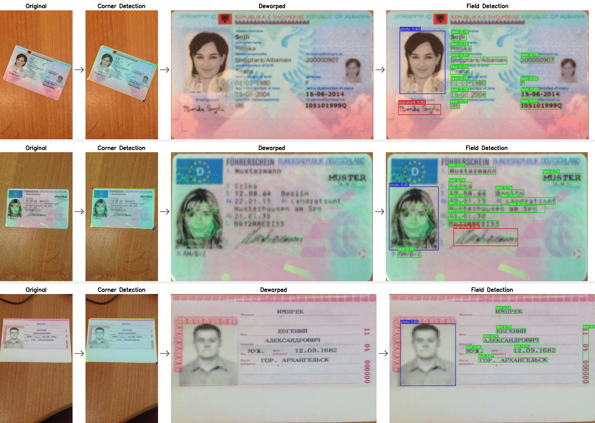

# docvision

REST API для обработки персональных документов: выравнивание фотографии, детекция полей, извлечение текста.

## Быстрый старт

**С GPU (NVIDIA):**

```bash
# Standard - локальная VLM (~10 GB VRAM, скачает модель при первом запуске)
docker compose up --build

# Lite - YOLO + EasyOCR (~1 GB VRAM, без VLM)
PIPELINE_MODE=lite docker compose up --build

# API - внешняя VLM через OpenAI-совместимый API
PIPELINE_MODE=api VLM_API_KEY=sk-... VLM_BASE_URL=https://api.openai.com/v1 VLM_MODEL=gpt-5.4 docker compose up --build
```

**Без GPU (CPU):**

```bash
# Lite на CPU
PIPELINE_MODE=lite docker compose -f docker-compose.yml -f docker-compose.cpu.yml up --build

# API на CPU
PIPELINE_MODE=api VLM_API_KEY=sk-... VLM_BASE_URL=https://api.openai.com/v1 VLM_MODEL=gpt-5.4 \
    docker compose -f docker-compose.yml -f docker-compose.cpu.yml up --build
```

```bash
# Проверка здоровья
curl localhost:8000/health

# Обработка документа
curl -X POST localhost:8000/process -F "file=@photo.jpg"

# Или открыть веб-интерфейс
open http://localhost:8000
```

<details>
<summary>Пример ответа</summary>

```json
{
  "fields": {
    "surname": "SMITH",
    "name": "JOHN",
    "birth_date": "01.01.1990"
  },
  "detections": [
    {"label": "text", "confidence": 0.95, "bbox": [10, 20, 300, 50]},
    {"label": "photo", "confidence": 0.92, "bbox": [50, 100, 250, 400]}
  ],
  "dewarped_image": "<base64 JPEG>",
  "annotated_image": "<base64 JPEG с bbox детекций>"
}
```

</details>

## Архитектура



### Режимы работы

| Режим | Пайплайн | VRAM | Поля |
|-------|----------|------|------|
| **lite** | YOLO corners → dewarp → YOLO fields → EasyOCR | ~1 GB | `field_1`, `field_2`, ... |
| **standard** | YOLO corners → dewarp → YOLO fields → VLM (Qwen2.5-VL-3B) | ~10 GB | `surname`, `name`, ... |
| **api** | YOLO corners → dewarp → YOLO fields → VLM (внешний API) | ~0.5 GB | `surname`, `name`, ... |

- **lite** - кропает каждое обнаруженное текстовое поле и распознаёт через EasyOCR. Поля нумеруются пространственно (сверху вниз, слева направо). Не требует VLM.
- **standard** - VLM анализирует всё изображение целиком, извлекает поля с семантическими именами. Дефолт.
- **api** - то же, что standard, но VLM работает через внешний API (OpenAI, OpenRouter, vLLM). **Внимание:** изображения документов отправляются внешнему провайдеру - учитывайте требования к конфиденциальности персональных данных.

### Этапы пайплайна

| # | Этап | Модель / Метод | Описание |
|---|------|---------------|----------|
| 1 | Детекция углов | YOLO11n-pose (5.6 MB) | Находит 4 угла документа как keypoints |
| 2 | Выравнивание | OpenCV `getPerspectiveTransform` | Перспективная коррекция по 4 точкам |
| 3 | Детекция полей | YOLO11n (5.4 MB) | Детектирует области: text, photo, signature |
| 4 | Извлечение текста | VLM / EasyOCR | Зависит от режима (`PIPELINE_MODE`) |

## Выбор моделей

### Детекция углов (YOLO11n-pose)

**Почему:** Задача сводится к keypoint detection - нужно найти ровно 4 угла документа. YOLO11n-pose решает это одним проходом с минимальным размером модели (5.6 MB).

**Альтернативы:**
- *OpenCV (Canny + Hough / findContours)* - работает только на контрастных фонах, не справляется с клаттером и частичной видимостью
- *Полноразмерные детекторы (YOLOv8-l, Detectron2)* - избыточны для 4 точек, в 10-50x больше по размеру
- *Segmentation + postprocessing* - двухэтапный подход, сложнее в поддержке

**Обучение:** дообучена на MIDV-500 (15 000 кадров, 50 типов документов, 5 условий съёмки). Конвергенция за ~50 эпох.

### Детекция полей (YOLO11n)

**Почему:** 3 класса (text, photo, signature) - простая задача для object detection. YOLO11n (5.4 MB) обеспечивает достаточную точность при минимальном размере.

**Альтернативы:**
- *YOLO11m/l* - точнее, но 40-90 MB, избыточно для 3 классов
- *LayoutLM / DocTR* - ориентированы на сложные макеты (таблицы, параграфы), перегружены для ID-карт
- *Rule-based (по координатам)* - не обобщает на новые типы документов

**Обучение:** дообучена на MIDV-2020 templates (1000 документов, 10 типов) с аннотациями полей.

### Извлечение текста

**Standard/API режимы - VLM:** одной моделью решает и распознавание текста, и структурирование полей. Qwen2.5-VL-3B - компромисс между качеством и ограничением в 10 GB VRAM. При наличии `VLM_API_KEY` используется внешний OpenAI-совместимый API (GPT и др.).

**Lite режим - EasyOCR:** классический OCR-движок на PyTorch. Работает с минимальным VRAM (~1 GB), но не структурирует поля - возвращает `field_1`, `field_2`, ... в порядке расположения на документе (сверху вниз, слева направо).

**Альтернативы VLM:**
- *PaddleOCR-VL (0.9B)* - raw OCR модель, 100% parse failure на задаче извлечения полей
- *DeepSeek-OCR-2 (3B)* - аналогично, raw OCR без структурирования
- *Qwen2.5-VL-7B* - лучше по качеству (CER 0.258 vs 0.428), но не помещается в 10 GB VRAM
- *Qwen3-VL-8B* - лучший результат (CER 0.250), но ~16 GB VRAM

## Метрики

Offline-оценка на 50 dewarped кадрах из MIDV-2019/2020 (15 типов документов, 625 GT полей).

> **Важно:** рантайм (`app/models/vlm.py`) использует **generic** промпт ("extract all
> text fields as JSON") без примера для конкретного типа документа. Строка "Текущее
> поведение API" в таблице показывает реальное качество в проде.
> Метрики few_shot получены в offline-эксперименте (`scripts/eval_vlm_prompts.py`), где
> модель получала пример ожидаемого JSON - это верхняя граница, достижимая при интеграции
> few_shot в продакшн-промпт.

| Модель | Промпт | CER | Exact Match | Примечание |
|--------|--------|----:|------------:|------------|
| Qwen2.5-VL-3B | generic | 0.937 | 14.7% | **Текущее поведение API** (standard) |
| Qwen2.5-VL-3B | few_shot | 0.428 | 54.2% | Offline-эксперимент, верхняя граница |
| Qwen2.5-VL-7B | few_shot | 0.258 | 67.5% | ~14 GB VRAM, не помещается в 10 GB |
| Qwen3-VL-8B | two_stage | 0.250 | 68.4% | ~16 GB VRAM |
| GPT-5.4 (API) | generic | 0.153 | - | Внешний API, лучший результат |

**CER** (Character Error Rate) - доля символьных ошибок. Ниже - лучше.

### Влияние prompt-стратегии

Эксперимент показал, что промпт важнее размера модели:

| Стратегия | CER (3B) | CER (7B) | Описание |
|-----------|----------|----------|----------|
| few_shot | 0.428 | 0.258 | Пример JSON для типа документа (offline) |
| field_list | 1.095 | 0.970 | Список ожидаемых полей в промпте |
| generic | 0.937 | 0.846 | "Extract all text fields as JSON" |

Стратегия few_shot с 3B (CER 0.428) лучше, чем generic с 7B (CER 0.846).

### Воспроизведение метрик

```bash
# 1. Подготовить тестовый набор (нужны датасеты MIDV-2019/2020)
python scripts/prepare_vlm_testset.py --output /tmp/vlm_testset/

# 2. Запустить оценку prompt-стратегий (нужен GPU с >=14 GB VRAM)
python scripts/eval_vlm_prompts.py --testset /tmp/vlm_testset/ --output data/vlm_eval/

# 3. Оценка через внешний API
VLM_API_KEY=... VLM_BASE_URL=https://api.openai.com/v1 VLM_MODEL=gpt-5.4 \
    python scripts/eval_api.py --max-docs 50
```

## API

### Web UI

Веб-интерфейс доступен по адресу `/` - drag & drop загрузка, отображение результатов (dewarped/annotated изображения, таблица полей, список детекций).

### `POST /process`

Обработка фотографии документа.

**Вход:** `multipart/form-data`, поле `file` - изображение (JPEG, PNG).

**Выход:**

| Поле | Тип | Описание |
|------|-----|----------|
| `fields` | `object` | Извлечённые текстовые поля (`{"surname": "...", ...}`) |
| `detections` | `array` | Детекции полей: `label`, `confidence`, `bbox [x1,y1,x2,y2]` |
| `dewarped_image` | `string` | Выровненное изображение в base64 JPEG |
| `annotated_image` | `string` | Выровненное изображение с нарисованными bbox детекций в base64 JPEG |

**Ошибки:**

| Код | Причина |
|-----|---------|
| 400 | Пустой файл |
| 422 | Документ не найден на изображении / не удалось декодировать |
| 503 | Модели ещё загружаются |

### `GET /health`

```json
{"status": "ok", "device": "cuda", "models_loaded": ["corner_detect", "field_detect", "vlm_local:Qwen/Qwen2.5-VL-3B-Instruct"]}
```

## Конфигурация

Переменные окружения (файл `.env` или `docker-compose.yml`):

| Переменная | По умолчанию | Описание |
|------------|-------------|----------|
| `PIPELINE_MODE` | `standard` | Режим: `lite`, `standard`, `api` |
| `DEVICE` | `auto` | Устройство: `auto`, `cuda`, `cpu` |
| `VLM_MODEL_ID` | `Qwen/Qwen2.5-VL-3B-Instruct` | Локальная VLM модель (standard) |
| `VLM_API_KEY` | - | API ключ внешней VLM (api) |
| `VLM_BASE_URL` | - | Base URL OpenAI-совместимого API (api) |
| `VLM_MODEL` | - | Название модели для API (api) |
| `OCR_LANG` | `en` | Язык OCR, через запятую (lite) |
| `CORNER_CONF` | `0.25` | Порог уверенности детекции углов |
| `FIELD_CONF` | `0.25` | Порог уверенности детекции полей |
| `HF_HOME` | `/root/.cache/huggingface` | Кеш HuggingFace (внутри контейнера) |

## Структура проекта

```
app/
├── main.py          # FastAPI: endpoints /process, /health, / (Web UI)
├── config.py        # Pydantic Settings: env vars
├── pipeline.py      # Оркестрация: bytes → ProcessResponse
├── schemas.py       # Pydantic-модели ответов
├── static/
│   └── index.html   # Web UI (single-page app)
└── models/
    ├── corner.py    # YOLO11n-pose: углы + dewarp
    ├── fields.py    # YOLO11n: text/photo/signature
    ├── vlm.py       # Qwen2.5-VL (local) / OpenAI API (standard/api)
    └── ocr.py       # EasyOCR обёртка (lite)
models/
├── corner_detect.pt # Веса детекции углов
└── field_detect.pt  # Веса детекции полей
examples/            # Примеры документов для тестирования
```

## Примеры

В папке `examples/` - 5 фотографий документов из MIDV-2020 для тестирования:

| Файл | Документ |
|------|----------|
| `albanian_id.jpg` | ID-карта Албании |
| `spanish_id.jpg` | ID-карта Испании |
| `finnish_id.jpg` | ID-карта Финляндии |
| `slovak_id.jpg` | ID-карта Словакии |
| `azerbaijani_passport.jpg` | Паспорт Азербайджана |

Все примеры - фото на столе с фоном и перспективой, латиница. Работают во всех режимах (lite/standard/api).

## Требования

- Docker + Docker Compose
- NVIDIA GPU с >=10 GB VRAM (standard) / >=1 GB (lite) или CPU + внешний API (api)
- NVIDIA Container Toolkit

## Тестовое окружение

- Ubuntu Server 22.04
- Docker Compose v2.25.0
- NVIDIA GeForce RTX 2080 Ti (11 GB)
- NVIDIA Driver 535.171.04

